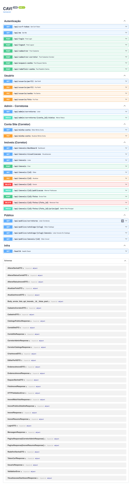
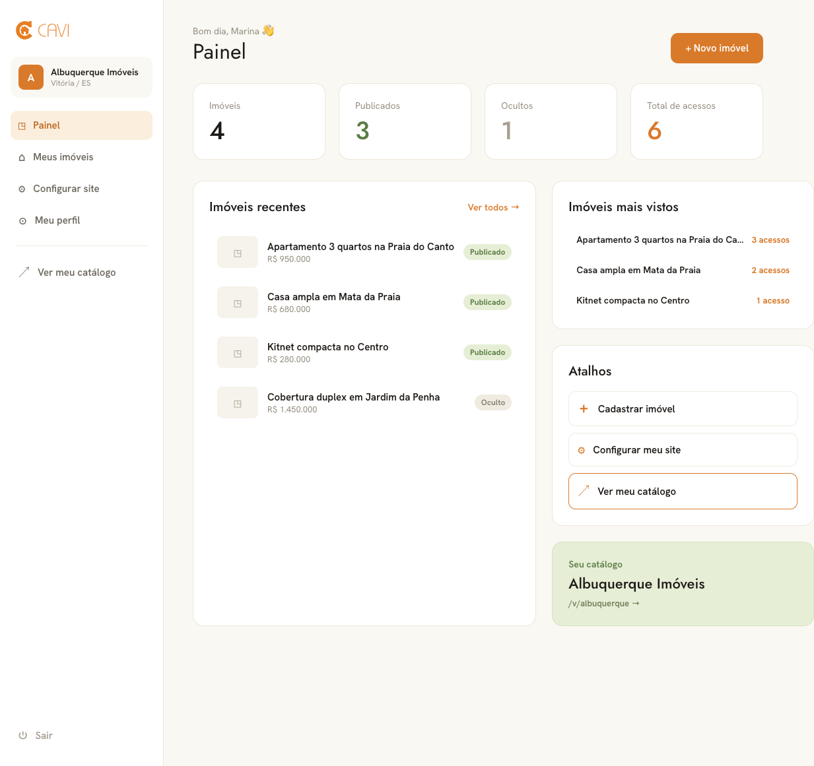
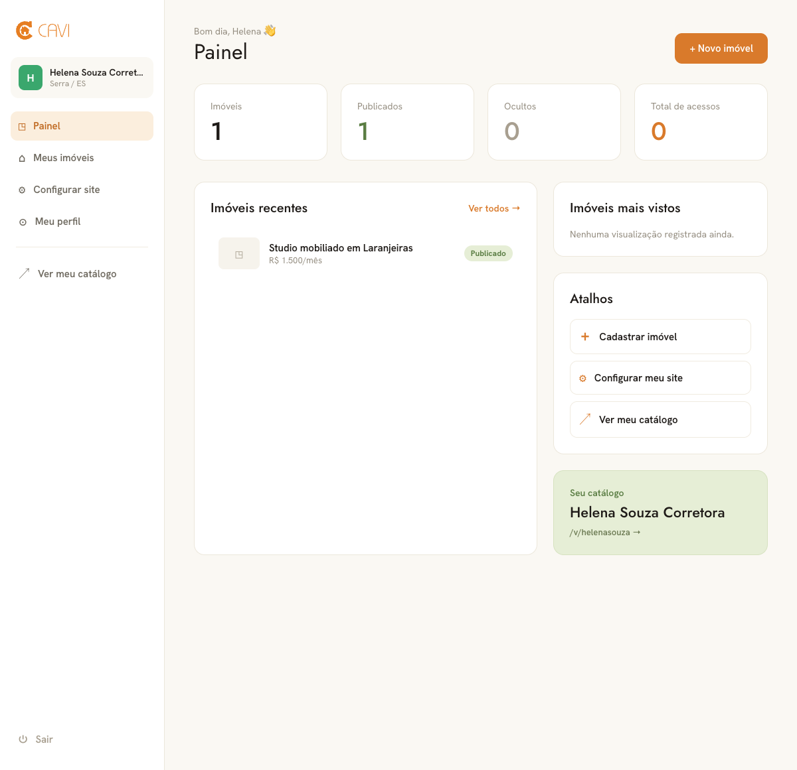
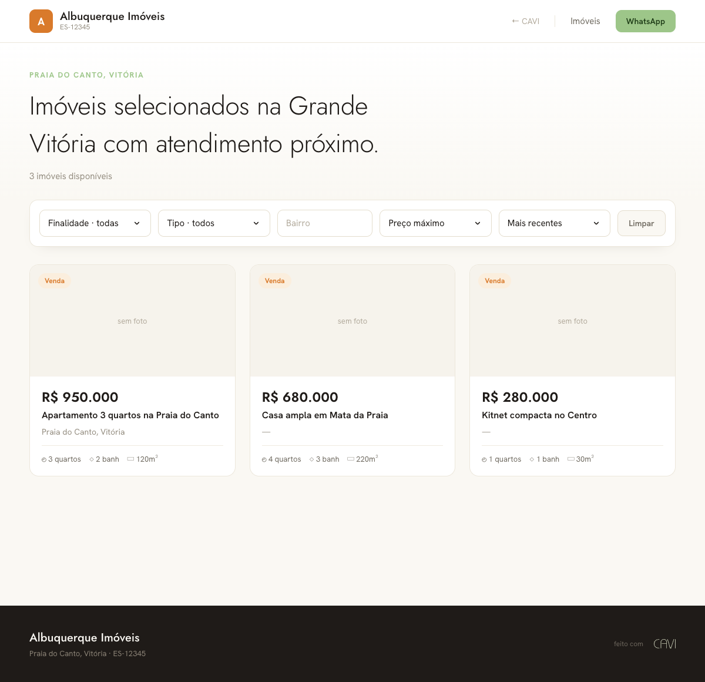
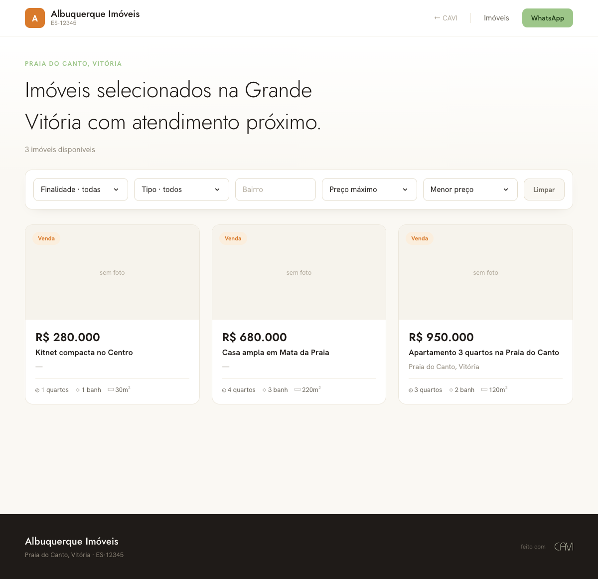

# Tutorial passo a passo — Contador de visualizações do imóvel + Ordenar catálogo público

Este tutorial foi escrito para você seguir do zero, sem precisar saber nada de antemão. Vamos com calma e **sem pular nada**. Se você fizer cada passo na ordem, no final vai ter as duas funcionalidades rodando de ponta a ponta (ou seja, do banco de dados até a tela que aparece no navegador). Leia com atenção, copie os códigos exatamente como estão e confira cada caminho de arquivo. Sempre que aparecer um termo técnico pela primeira vez, eu explico em seguida o que ele significa.

---

## Setup — preparando o computador do zero

Antes de tocar no código, você precisa instalar algumas ferramentas e baixar o projeto. Faça esta seção inteira **uma vez só**; depois é só programar. Se você já tem alguma dessas ferramentas, pule a instalação dela e só confira a versão.

### 1. Instalar as ferramentas

Você vai precisar de quatro programas:

- **Git** — guarda o histórico do código e baixa o projeto da internet. Baixe em [git-scm.com](https://git-scm.com/downloads).
- **Python 3.11 ou mais novo** — é a linguagem do backend (a parte que roda no servidor). Baixe em [python.org/downloads](https://www.python.org/downloads/). **Atenção:** o projeto tem um arquivo `.python-version` apontando para a versão 3.14, que pode ainda nem existir no seu computador. Não tem problema: mais abaixo eu mostro como criar o ambiente usando o Python 3.11, que funciona perfeitamente.
- **Bun** — é o programa que instala e roda as bibliotecas do frontend (a parte que aparece no navegador). É o substituto que este projeto usa no lugar do npm. Instale seguindo as instruções de [bun.sh](https://bun.sh).
- **VSCode** — o editor de código onde você vai escrever tudo. Baixe em [code.visualstudio.com](https://code.visualstudio.com).

Depois de instalar, **feche e abra o terminal** (para ele "enxergar" os programas novos) e confira se cada um respondeu com um número de versão:

```bash
git --version
python --version
bun --version
```

Se algum comando der "command not found" (comando não encontrado), a instalação não terminou ou o terminal não foi reaberto. Resolva isso antes de seguir, senão os próximos passos não vão funcionar.

> Por que conferir a versão? Porque um número de versão respondendo é a prova de que o programa foi instalado e o terminal sabe onde ele está. É o jeito mais rápido de descobrir um problema agora, em vez de no meio do tutorial.

### 2. Baixar o projeto (clonar o repositório)

"Clonar" é baixar uma cópia completa do projeto, com todo o histórico, para a sua máquina. Em um terminal, na pasta onde você quer guardar o projeto, rode:

```bash
git clone https://github.com/Sa-mu-el20/cavi.git
cd cavi
```

Isso cria uma pasta `cavi` com o código dentro. O `cd cavi` entra nessa pasta — todos os comandos seguintes assumem que você está dentro dela.

### 3. Preparar o backend (Python)

O backend tem suas próprias bibliotecas, e a boa prática é instalá-las dentro de um **ambiente virtual** (chamado de "venv"). Pense no venv como uma caixinha isolada só para este projeto: assim as bibliotecas dele não se misturam com as de outros projetos no seu computador.

Crie o venv usando o Python 3.11 (mesmo que o `.python-version` peça 3.14) e ative-o:

```bash
cd backend
python -m venv .venv
```

Agora **ative** o ambiente. O comando muda conforme o sistema:

```bash
# Windows (PowerShell)
.venv\Scripts\Activate.ps1

# macOS / Linux
source .venv/bin/activate
```

Com o venv ativado (você vai ver `(.venv)` no início da linha do terminal), instale as bibliotecas que o projeto precisa:

```bash
pip install -r requirements.txt
```

> O `requirements.txt` é uma lista das bibliotecas do backend. O `pip install -r` lê essa lista e baixa tudo de uma vez, na versão certa.

### 4. Preparar o frontend (Bun)

Agora as bibliotecas da parte visual. A partir da raiz do projeto, entre na pasta `frontend` e use o Bun:

```bash
cd frontend
bun install
```

Isso baixa tudo que o frontend precisa. Use sempre o **Bun** neste projeto — não use `npm`, mesmo que você veja `npm` em tutoriais por aí.

### 5. Rodar o projeto

Você vai deixar duas coisas rodando ao mesmo tempo, cada uma em um terminal:

```bash
# Terminal 1 — backend (com o venv ativado, dentro de backend/)
.venv/bin/python main.py
```

```bash
# Terminal 2 — frontend (dentro de frontend/)
bun run dev
```

O backend sobe na porta **8411** e o frontend na **5181**. Abra `http://localhost:5181` no navegador para ver o site no ar.

### 6. Criar uma branch para o seu trabalho

Antes de começar a programar, crie uma **branch**. Uma branch é como uma "linha do tempo paralela" do código: você faz suas mudanças nela sem mexer na versão principal (a `main`). Se algo der errado, é só voltar para a `main` que está intacta. Por isso nunca trabalhamos direto na principal.

Da raiz do projeto:

```bash
git checkout -b minha-feature
```

O `-b` cria a branch nova chamada `minha-feature` e já te coloca dentro dela. Daqui pra frente, tudo que você fizer fica nessa branch.

### 7. Extensões recomendadas do VSCode

Extensões são "plugins" que deixam o VSCode mais esperto para cada linguagem. Abra o VSCode na pasta do projeto, vá no ícone de extensões (na barra lateral) e instale estas:

- **Python** — dá suporte básico para escrever e rodar código Python.
- **Pylance** — autocompletar inteligente e checagem de tipos do Python enquanto você digita.
- **Python Debugger** — permite rodar o código passo a passo para achar erros.
- **Python Environments** — ajuda a escolher e gerenciar o venv certo dentro do editor.
- **ESLint** — aponta problemas e descuidos no código do frontend (JavaScript/TypeScript).
- **SQLite3 Editor** — abre e mostra o banco de dados do projeto direto no editor.
- **vscode-icons** — coloca ícones nos arquivos para você se achar mais rápido na lista.
- **HTML CSS Support** — autocompletar para HTML e CSS.

Pronto. Com tudo instalado, o projeto rodando e a sua branch criada, você está pronto para começar.

---

## O que você vai construir

Você vai construir **duas funcionalidades** (no jargão de programação, chamamos de "features") no projeto CAVI. O CAVI é um site de imobiliária onde cada corretor tem um catálogo público com os seus imóveis.

A primeira feature é um **contador de visualizações**: toda vez que um visitante abre a página de detalhe de um imóvel, o sistema anota essa visita em uma tabela nova do banco de dados (`visualizacao_imovel`). Com esses dados, o painel do corretor (o "dashboard", que é a tela de controle dele) ganha um bloco "Imóveis mais vistos" (os 5 campeões de acessos) e um número de "Total de acessos".

A segunda feature é a **ordenação do catálogo público**: o visitante vai poder escolher a ordem em que os imóveis aparecem (mais recentes, menor preço, maior preço) usando um seletor na tela. Esse seletor envia um parâmetro chamado `ordenar` para a API e muda o `ORDER BY` (o trecho do comando que define a ordem) da consulta no banco. Aqui já aparece a palavra **API**: é o "garçom" do sistema — o programa do servidor que recebe os pedidos da tela e devolve os dados. Cada pedido específico que a API atende (por exemplo, "me dê os imóveis deste catálogo") é chamado de **endpoint**, que é um endereço com uma função bem definida.

Resultado final:

- Nova tabela `visualizacao_imovel` criada automaticamente quando o backend sobe.
- Cada `GET /api/publico/imoveis/{id}` registra uma linha de visualização.
- Novo endpoint `GET /api/imoveis/visualizacoes` que devolve o total de acessos e o top 5 de imóveis mais vistos do corretor logado.
- Dashboard do corretor com um card "Total de acessos" e uma lista "Imóveis mais vistos".
- Novo query param `ordenar` em `GET /api/publico/catalogo/{slug}/imoveis` com os valores `recentes`, `preco_asc`, `preco_desc`.
- Seletor de ordenação na `CatalogPage` (tela pública do catálogo).

---

## Pré-requisitos

Antes de começar, deixe **backend e frontend rodando** ao mesmo tempo, em dois terminais separados.

**Terminal 1 — backend** (a partir da raiz do projeto):

```bash
backend/.venv/bin/python backend/main.py
```

> O backend sobe na porta **8411**. A documentação interativa (Swagger) fica em `http://localhost:8411/docs`. Use o interpretador do venv (`backend/.venv/bin/python`), nunca o `python` global.

**Terminal 2 — frontend** (a partir da pasta `frontend/`):

```bash
cd frontend
bun run dev
```

> O Vite sobe na porta **5181** e faz proxy de `/api`, `/static` e `/health` para o backend. Abra `http://localhost:5181` no navegador.

Para testar a área do corretor você precisa estar **logado como corretor** e já ter um catálogo com pelo menos um imóvel publicado. Se ainda não tiver, cadastre um corretor pela tela `/login` (aba de cadastro) e crie um imóvel em `/app/imoveis/novo`, deixando-o como **Publicado**.

---

## As camadas que vamos tocar e a ordem de implementação

O backend do CAVI é organizado em "camadas", cada uma com um papel: **Routes → DTOs → Repos → SQL → DB**. Em português, da tela para o fundo: as **Routes** (rotas) recebem os pedidos; os **DTOs** definem o formato dos dados que entram e saem (DTO quer dizer "Data Transfer Object", ou "objeto de transferência de dados" — é basicamente um molde que descreve quais campos uma mensagem tem); os **Repos** (repositórios) executam as operações; o **SQL** são os comandos que falam com o banco; e o **DB** é o banco de dados em si. O frontend tem a sua própria ordem: **api → types → schemas → páginas → router**.

Vamos construir **de baixo para cima**: primeiro o banco, depois o que usa o banco, e por último a tela. Por quê? Porque cada camada **depende** da que está embaixo dela: a rota só funciona se o repositório existir, o repositório só funciona se o SQL existir, e a tela só funciona se a API já estiver respondendo. Se você começasse pela tela, não teria nada pronto para testar.

Ordem completa:

**Feature A — Contador de visualizações**

1. **SQL** — `backend/sql/visualizacao_imovel_sql.py` (NOVO): `CREATE TABLE` + queries de inserir, contar e top 5.
2. **Repo** — `backend/repo/visualizacao_imovel_repo.py` (NOVO): `criar_tabela()`, `registrar()`, `contar_por_conta()`, `top_mais_vistos()`.
3. **Registrar a tabela no startup** — `backend/main.py` (EDIÇÃO): importar o repo e adicioná-lo à lista `TABELAS`.
4. **Rota de registro** — `backend/routes/publico_routes.py` (EDIÇÃO): no `GET /publico/imoveis/{id}`, chamar `registrar()`.
5. **Response DTO** — `backend/dtos/responses/visualizacao_response.py` (NOVO): formato do payload do dashboard.
6. **Rota do dashboard** — `backend/routes/imoveis_routes.py` (EDIÇÃO): novo `GET /imoveis/visualizacoes`.
7. **Frontend tipos** — `frontend/src/lib/types.ts` (EDIÇÃO): tipos espelhando o response.
8. **Frontend dashboard** — `frontend/src/pages/corretor/DashboardCorretorPage.tsx` (EDIÇÃO): card + lista.

**Feature B — Ordenar catálogo**

9. **SQL** — `backend/sql/imovel_sql.py` (EDIÇÃO): constantes de `ORDER BY` por critério.
10. **Repo** — `backend/repo/imovel_repo.py` (EDIÇÃO): parâmetro `ordenar` em `listar_por_conta`.
11. **Rota** — `backend/routes/publico_routes.py` (EDIÇÃO): query param `ordenar` repassado ao repo.
12. **Frontend catálogo** — `frontend/src/pages/catalogo/CatalogPage.tsx` (EDIÇÃO): seletor de ordenação.

---

# FEATURE A — Contador de visualizações

## Passo 1 — SQL da nova tabela

### Arquivo: `backend/sql/visualizacao_imovel_sql.py` — ARQUIVO NOVO

Crie este arquivo. Ele guarda **só os comandos SQL em texto** (as "strings de SQL"). Eles são escritos como *prepared statements* (comandos preparados): em vez de colar valores direto no texto do comando, deixamos um `?` no lugar e mandamos o valor à parte. Isso é mais seguro, porque impede que alguém injete comando malicioso pelo campo de dados. É o mesmo estilo do `imovel_sql.py` que já existe no projeto.

```python
"""
SQL puro (prepared statements) do módulo Visualização de Imóvel.

Cada linha de ``visualizacao_imovel`` representa um acesso ao detalhe público
de um imóvel. Serve aos contadores do dashboard do corretor (total de acessos
e ranking de imóveis mais vistos).
"""

# ===================== TABELA =====================

CRIAR_TABELA = """
CREATE TABLE IF NOT EXISTS visualizacao_imovel (
    id INTEGER PRIMARY KEY AUTOINCREMENT,
    imovel_id INTEGER NOT NULL,
    data_visualizacao TIMESTAMP,
    FOREIGN KEY (imovel_id) REFERENCES imovel(id) ON DELETE CASCADE
)
"""

# ===================== REGISTRO =====================

REGISTRAR = """
INSERT INTO visualizacao_imovel (imovel_id, data_visualizacao)
VALUES (?, ?)
"""

# ===================== CONTADORES (DASHBOARD) =====================

# Total de acessos a TODOS os imóveis de uma conta-site (JOIN com imovel para
# escopar pela conta do corretor).
CONTAR_POR_CONTA = """
SELECT COUNT(*) AS total
FROM visualizacao_imovel v
INNER JOIN imovel i ON v.imovel_id = i.id
WHERE i.conta_site_id = ?
"""

# Top 5 imóveis mais vistos de uma conta-site, com o título e a contagem.
TOP_MAIS_VISTOS = """
SELECT i.id AS imovel_id, i.titulo AS titulo, COUNT(v.id) AS total
FROM visualizacao_imovel v
INNER JOIN imovel i ON v.imovel_id = i.id
WHERE i.conta_site_id = ?
GROUP BY i.id, i.titulo
ORDER BY total DESC, i.id DESC
LIMIT 5
"""
```

Pontos importantes:

- `CREATE TABLE IF NOT EXISTS` — só cria a tabela se ela ainda não existir; assim não dá erro quando o sistema sobe de novo (o startup, ou seja, a inicialização do servidor, roda isso toda vez).
- `id INTEGER PRIMARY KEY AUTOINCREMENT` — a coluna `id` é a chave primária (o número único que identifica cada linha) e cresce sozinha a cada nova linha. É o padrão do projeto.
- `data_visualizacao TIMESTAMP` — a coluna que guarda a data e a hora do acesso, igual às outras tabelas.
- `FOREIGN KEY (imovel_id) ... ON DELETE CASCADE` — a "chave estrangeira" liga cada visualização a um imóvel. O `ON DELETE CASCADE` faz o seguinte: se o imóvel for apagado, as visualizações dele somem junto, sem deixar lixo no banco.
- `CONTAR_POR_CONTA` e `TOP_MAIS_VISTOS` usam `INNER JOIN imovel` (juntar as duas tabelas pelo campo em comum) porque a tabela de visualização não sabe de qual corretor é o imóvel; quem guarda o `conta_site_id` (o dono do imóvel) é a tabela `imovel`.
- `GROUP BY` + `COUNT(...)` é uma **agregação**: agrupa as linhas por imóvel e conta quantas existem em cada grupo — é assim que descobrimos quantos acessos cada imóvel teve.

---

## Passo 2 — Repositório

### Arquivo: `backend/repo/visualizacao_imovel_repo.py` — ARQUIVO NOVO

Crie este arquivo. Ele é a camada que **executa** o SQL (pega aquelas strings do passo anterior e roda no banco). Repare que copiamos fielmente o estilo do `imovel_repo.py`: a conexão com o banco é aberta com `with obter_conexao()`, as datas vêm da função `agora()`, e existe a função `criar_tabela()`. Seguir o mesmo padrão dos arquivos que já existem deixa o código mais fácil de entender para quem vier depois.

```python
"""
Repositório de Visualização de Imóvel (tabela ``visualizacao_imovel``).

Camada Repos da arquitetura Routes -> DTOs -> Repos -> SQL -> DB. SQL puro com
prepared statements, sem ORM. Datas de gravação usam ``agora()`` (NUNCA
``strftime``).
"""

from sql.visualizacao_imovel_sql import (
    CRIAR_TABELA,
    REGISTRAR,
    CONTAR_POR_CONTA,
    TOP_MAIS_VISTOS,
)
from util.db_util import obter_conexao
from util.datetime_util import agora


# ===================== TABELA =====================


def criar_tabela() -> bool:
    """Cria a tabela de visualizações (chamada no startup pelo main.py)."""
    with obter_conexao() as conn:
        cursor = conn.cursor()
        cursor.execute(CRIAR_TABELA)
        return True


# ===================== REGISTRO =====================


def registrar(imovel_id: int) -> bool:
    """Registra uma visualização (um acesso) do imóvel informado."""
    with obter_conexao() as conn:
        cursor = conn.cursor()
        cursor.execute(REGISTRAR, (imovel_id, agora()))
        return cursor.lastrowid is not None


# ===================== CONTADORES (DASHBOARD) =====================


def contar_por_conta(conta_site_id: int) -> int:
    """Total de acessos a todos os imóveis de uma conta-site."""
    with obter_conexao() as conn:
        cursor = conn.cursor()
        cursor.execute(CONTAR_POR_CONTA, (conta_site_id,))
        row = cursor.fetchone()
        return row["total"] if row else 0


def top_mais_vistos(conta_site_id: int) -> list[dict]:
    """Top 5 imóveis mais vistos de uma conta-site.

    Retorna uma lista de dicts ``{imovel_id, titulo, total}`` já ordenada do
    mais visto para o menos visto.
    """
    with obter_conexao() as conn:
        cursor = conn.cursor()
        cursor.execute(TOP_MAIS_VISTOS, (conta_site_id,))
        return [
            {
                "imovel_id": row["imovel_id"],
                "titulo": row["titulo"],
                "total": row["total"],
            }
            for row in cursor.fetchall()
        ]
```

Pontos importantes:

- `criar_tabela()` fica **no repo**, não no arquivo de SQL. É essa função que o `main.py` chama na inicialização do servidor.
- `registrar()` usa `agora()` (que vem de `util/datetime_util.py`) para pegar a data e a hora. **Nunca** use `datetime.now()` nem `.strftime()` direto — é regra do projeto, para que todas as datas venham do mesmo lugar e fiquem no mesmo formato.
- Todos os métodos abrem a conexão com `with obter_conexao() as conn:`. Esse `with` cuida de salvar as mudanças se tudo deu certo (commit) ou desfazê-las se algo falhou (rollback), e ainda liga a verificação de chaves estrangeiras — tudo automático, sem você precisar lembrar.
- Os valores vão sempre numa **tupla de parâmetros** (`(imovel_id, agora())`) separada do comando, nunca grudados no texto com f-string. É isso que evita o tal SQL injection (alguém enganar o banco mandando comando disfarçado de dado).
- `row["total"]` funciona porque o projeto configurou o banco com `row_factory = sqlite3.Row`, um ajuste que deixa a gente pegar o valor de cada coluna pelo nome dela, em vez de pela posição.

---

## Passo 3 — Registrar a tabela no startup (PASSO QUE MAIS GENTE ESQUECE)

### Arquivo: `backend/main.py` — EDIÇÃO

Sem este passo, a tabela `visualizacao_imovel` **nunca é criada** e você vai tomar um erro `no such table` ao acessar o detalhe de um imóvel. São duas mudanças pequenas no `main.py`.

**Mudança 3.1 — importar o novo repo.** Localize, perto do topo do arquivo, a linha que importa os repos do módulo de imóveis:

```python
from repo import conta_site_repo, imovel_repo, foto_imovel_repo
```

Adicione o novo repo nessa mesma importação:

```python
from repo import conta_site_repo, imovel_repo, foto_imovel_repo, visualizacao_imovel_repo
```

**Mudança 3.2 — adicionar à lista `TABELAS`.** Localize a lista `TABELAS` (logo abaixo do comentário "Criação de tabelas e seed"):

```python
TABELAS = [
    (usuario_repo, "usuario"),
    (conta_site_repo, "conta_site"),
    # imovel_repo.criar_tabela cria as três tabelas do módulo na ordem correta
    # de dependência: imovel -> endereco_imovel (1:1) -> foto_imovel (1:N).
    (imovel_repo, "imovel + endereco_imovel + foto_imovel"),
    (configuracao_repo, "configuracao"),
]
```

Adicione a entrada do novo repo **depois** de `imovel_repo` (a ordem importa: a tabela `visualizacao_imovel` tem FK para `imovel`, então `imovel` precisa existir antes):

```python
TABELAS = [
    (usuario_repo, "usuario"),
    (conta_site_repo, "conta_site"),
    # imovel_repo.criar_tabela cria as três tabelas do módulo na ordem correta
    # de dependência: imovel -> endereco_imovel (1:1) -> foto_imovel (1:N).
    (imovel_repo, "imovel + endereco_imovel + foto_imovel"),
    (visualizacao_imovel_repo, "visualizacao_imovel"),
    (configuracao_repo, "configuracao"),
]
```

O `main.py` tem um laço de repetição que passa por cada item de `TABELAS` e chama `repo.criar_tabela()`. Ao adicionar a sua tupla nessa lista, a sua tabela passa a ser criada junto com as outras quando o servidor sobe. **Reinicie o backend** (aperte Ctrl+C no Terminal 1 para parar e rode de novo) e procure no log (as mensagens que aparecem no terminal) a linha `Tabela 'visualizacao_imovel' criada/verificada`. Se ela apareceu, deu certo.

---

## Passo 4 — Registrar a visualização na rota pública

### Arquivo: `backend/routes/publico_routes.py` — EDIÇÃO

Agora vamos gravar uma visualização **toda vez** que alguém abrir o detalhe público de um imóvel.

**Mudança 4.1 — importar o repo.** Localize a importação dos repos no topo do arquivo:

```python
# Repositories
from repo import conta_site_repo, imovel_repo
```

Adicione o novo repo:

```python
# Repositories
from repo import conta_site_repo, imovel_repo, visualizacao_imovel_repo
```

**Mudança 4.2 — registrar dentro do `obter_imovel`.** Localize a função `obter_imovel` (decorada com `@router.get("/imoveis/{id}", ...)`). Ela termina assim:

```python
    conta = conta_site_repo.obter_por_id(imovel.conta_site_id)
    if not conta or conta.status != StatusConta.ATIVO:
        raise HTTPException(
            status_code=status.HTTP_404_NOT_FOUND,
            detail="Imóvel não encontrado.",
        )

    return ImovelPublicoDetalheResponse(
        imovel=ImovelResponse.de_imovel(imovel),
        catalogo=CatalogoPublicoResponse.de_conta(conta),
    )
```

Adicione a chamada `registrar(...)` logo **antes** do `return`, depois de já ter validado que o imóvel existe, está publicado e a conta está ativa:

```python
    conta = conta_site_repo.obter_por_id(imovel.conta_site_id)
    if not conta or conta.status != StatusConta.ATIVO:
        raise HTTPException(
            status_code=status.HTTP_404_NOT_FOUND,
            detail="Imóvel não encontrado.",
        )

    # Registra uma visualização deste imóvel (contador do dashboard do corretor).
    visualizacao_imovel_repo.registrar(imovel.id)

    return ImovelPublicoDetalheResponse(
        imovel=ImovelResponse.de_imovel(imovel),
        catalogo=CatalogoPublicoResponse.de_conta(conta),
    )
```

Pontos importantes:

- Registramos **só depois** de confirmar que o imóvel existe e está publicado. Assim não contamos acessos a imóveis escondidos ou que nem existem (esses casos já devolveram o erro 404 — "não encontrado" — antes de chegar aqui).
- Esta é uma rota `GET` pública (qualquer um acessa, sem login). `GET` é o tipo de pedido que só lê dados, sem mudar nada. No projeto, pedidos `GET` não exigem CSRF (uma proteção contra pedidos falsos vindos de outro site), então você não precisa se preocupar com token de segurança aqui.

---

## Passo 5 — Response DTO do dashboard de visualizações

### Arquivo: `backend/dtos/responses/visualizacao_response.py` — ARQUIVO NOVO

Crie este arquivo. Ele é um **DTO de resposta**: lembra que DTO é o "molde" que descreve o formato dos dados? Aqui o molde diz exatamente quais campos o JSON (o formato de texto que a API usa para mandar dados) vai ter quando o dashboard pedir as visualizações. Esse molde é o "contrato": o frontend vai copiar esse mesmo formato do outro lado, para os dois conversarem sem confusão.

```python
"""
Schemas de resposta do dashboard de visualizações (módulo Visualização).

Expõem o total de acessos e o ranking dos imóveis mais vistos de uma conta-site
(catálogo do corretor). Tipos espelhados em ``frontend/src/lib/types.ts``.
"""

from pydantic import BaseModel, Field


class ImovelMaisVistoResponse(BaseModel):
    """Uma linha do ranking de imóveis mais vistos."""

    imovel_id: int
    titulo: str
    total: int = Field(..., description="Quantidade de visualizações do imóvel")

    @classmethod
    def de_dict(cls, dados: dict) -> "ImovelMaisVistoResponse":
        """Constrói a partir do dict retornado pelo repositório."""
        return cls(
            imovel_id=dados["imovel_id"],
            titulo=dados["titulo"],
            total=dados["total"],
        )


class VisualizacoesDashboardResponse(BaseModel):
    """Payload do bloco de visualizações no dashboard do corretor."""

    total_acessos: int = Field(
        ..., description="Total de acessos a todos os imóveis da conta"
    )
    mais_vistos: list[ImovelMaisVistoResponse] = Field(
        default_factory=list, description="Top 5 imóveis mais vistos"
    )
```

Pontos importantes:

- Os nomes dos campos (`total_acessos`, `mais_vistos`, `imovel_id`, `titulo`, `total`) precisam ser **exatamente iguais** aos do frontend (Passo 7). Se mudar um nome de um lado, mude do outro também, senão eles param de se entender.
- O `classmethod` `de_dict` (um método "de fábrica", que monta um objeto a partir de um dicionário) segue o padrão `de_<algo>` usado em todos os DTOs de resposta do projeto (como `de_conta`, `de_imovel`). Seguir o mesmo nome ajuda quem lê o código.
- `default_factory=list` faz `mais_vistos` começar como uma lista vazia quando não houver nenhum dado, em vez de dar erro.

---

## Passo 6 — Rota do dashboard de visualizações

### Arquivo: `backend/routes/imoveis_routes.py` — EDIÇÃO

Vamos criar um endpoint novo na área do corretor: `GET /imoveis/visualizacoes`. Ele exige login e devolve os dados da conta do corretor logado.

**Mudança 6.1 — importar o repo e o response.** No topo do arquivo, localize a importação dos repos:

```python
# Repositories
from repo import conta_site_repo, foto_imovel_repo, imovel_repo
```

Adicione o novo repo:

```python
# Repositories
from repo import conta_site_repo, foto_imovel_repo, imovel_repo, visualizacao_imovel_repo
```

Em seguida, localize as importações dos schemas de saída:

```python
# Schemas (saída)
from dtos.responses.comum import MensagemResponse, PaginaResponse
from dtos.responses.imovel_response import ImovelResponse, ImovelResumoResponse
```

Adicione a importação do novo response:

```python
# Schemas (saída)
from dtos.responses.comum import MensagemResponse, PaginaResponse
from dtos.responses.imovel_response import ImovelResponse, ImovelResumoResponse
from dtos.responses.visualizacao_response import (
    ImovelMaisVistoResponse,
    VisualizacoesDashboardResponse,
)
```

**Mudança 6.2 — criar o endpoint.** Localize a função `dashboard` (decorada com `@router.get("/dashboard")`). Logo **depois** dela (antes da seção de Listagem), adicione o novo endpoint:

```python
# =============================================================================
# Dashboard de visualizações
# =============================================================================

@router.get("/visualizacoes", response_model=VisualizacoesDashboardResponse)
@requer_autenticacao()
async def visualizacoes(
    request: Request,
    usuario_logado: Optional[UsuarioLogado] = None,
):
    """Total de acessos e top 5 de imóveis mais vistos da conta do corretor."""
    assert usuario_logado is not None
    conta = _obter_conta_do_usuario(usuario_logado)

    total = visualizacao_imovel_repo.contar_por_conta(conta.id)
    mais_vistos = visualizacao_imovel_repo.top_mais_vistos(conta.id)

    return VisualizacoesDashboardResponse(
        total_acessos=total,
        mais_vistos=[ImovelMaisVistoResponse.de_dict(m) for m in mais_vistos],
    )
```

Pontos importantes:

- `@requer_autenticacao()` sem nada dentro dos parênteses significa "qualquer usuário logado pode acessar". Esse `@...` é um **decorator** — um envelope que adiciona um comportamento à função (aqui, a checagem de login) sem você reescrever nada. Ele entrega o `usuario_logado` para a função (por isso ele aparece como `Optional[...] = None` na assinatura). O `assert` serve só para o verificador de tipos entender que, daqui pra frente, ele não é `None`.
- `request: Request` vem primeiro e `usuario_logado` por último — é a ordem padrão das rotas do projeto.
- `_obter_conta_do_usuario(usuario_logado)` é um "helper" (uma função auxiliar) que já existe neste arquivo; ele descobre qual é a conta do corretor logado (e devolve 404 se ele ainda não tem catálogo).
- Coloque a rota `/visualizacoes` **antes** da rota `/{id}` (que fica mais abaixo). Como `/visualizacoes` é um caminho fixo e `/{id}` é variável (pode ser qualquer número), se a fixa viesse depois o FastAPI ainda acertaria (caminhos exatos têm prioridade), mas por clareza deixamos a fixa lá em cima, junto do `/dashboard`.

> **Importante sobre o router:** você **não** precisa registrar nada novo no `main.py` para este endpoint. O router (o objeto que agrupa as rotas) `imoveis_router` já está cadastrado lá na lista `ROUTERS`. Você só mexe no `main.py` quando cria um **arquivo de router novo**. Aqui a gente só pendurou mais uma rota num router que já existia.

Teste no Swagger (a página que lista e deixa você experimentar os endpoints): reinicie o backend, abra `http://localhost:8411/docs`, e confira que apareceu `GET /api/imoveis/visualizacoes`.



---

## Passo 7 — Tipos no frontend

### Arquivo: `frontend/src/lib/types.ts` — EDIÇÃO

Agora começa a parte da tela (o frontend). O primeiro passo é "espelhar" o DTO de resposta do backend em tipos do TypeScript — ou seja, escrever do lado do frontend o mesmo molde de dados que o backend usa, para o editor saber quais campos esperar. Vá ao **final** do arquivo `types.ts` e adicione:

```ts
// ===== Visualizações (dashboard do corretor) =====
// Espelha backend/dtos/responses/visualizacao_response.py.
export interface ImovelMaisVisto {
  imovel_id: number
  titulo: string
  total: number
}

export interface VisualizacoesDashboard {
  total_acessos: number
  mais_vistos: ImovelMaisVisto[]
}
```

Pontos importantes:

- Os nomes (`total_acessos`, `mais_vistos`, `imovel_id`, `titulo`, `total`) são iguaizinhos aos do DTO de resposta do backend (Passo 5). É o tal "contrato espelhado": mexeu de um lado, copie no outro.
- Os números do Python (`int`, número inteiro) viram `number` no TypeScript.
- Como essa feature só **lê** dados (não tem formulário para o usuário preencher e enviar), **não** precisamos criar nada em `schemas.ts`. Os schemas do Zod (uma biblioteca que valida o que o usuário digita) só servem para os formulários de envio.

---

## Passo 8 — Dashboard do corretor

### Arquivo: `frontend/src/pages/corretor/DashboardCorretorPage.tsx` — EDIÇÃO

Vamos buscar os dados de visualizações e mostrá-los: um card "Total de acessos" e uma lista "Imóveis mais vistos".

**Mudança 8.1 — importar o tipo novo.** Localize a linha de import de tipos:

```ts
import type { ContaSite, ImovelResumo, PaginaResponse } from '../../lib/types'
```

Adicione o tipo `VisualizacoesDashboard`:

```ts
import type { ContaSite, ImovelResumo, PaginaResponse, VisualizacoesDashboard } from '../../lib/types'
```

**Mudança 8.2 — buscar os dados.** Dentro do componente `DashboardCorretorPage`, localize o último `useFetch` (o que busca `recentesPagina`):

```ts
  const { data: recentesPagina } = useFetch<PaginaResponse<ImovelResumo>>(
    (signal) => api.get<PaginaResponse<ImovelResumo>>('/imoveis', {
      params: { pagina: 1, por_pagina: 4 },
      signal,
    }),
    [],
  )
```

Logo **depois** dele, adicione um novo `useFetch` para as visualizações:

```ts
  const { data: visualizacoes } = useFetch<VisualizacoesDashboard>(
    (signal) => api.get<VisualizacoesDashboard>('/imoveis/visualizacoes', { signal }),
    [],
  )
```

E logo abaixo das variáveis derivadas (`const recentes = recentesPagina?.items ?? []`), adicione:

```ts
  const totalAcessos = visualizacoes?.total_acessos ?? 0
  const maisVistos = visualizacoes?.mais_vistos ?? []
```

> Repare no padrão `?? 0` e `?? []`: o `??` quer dizer "se o que está à esquerda não existir, use o que está à direita". Enquanto os dados ainda estão chegando do servidor, `visualizacoes` é `undefined` (vazio), então caímos no valor padrão (0 ou lista vazia) e a tela não quebra.

**Mudança 8.3 — mostrar o card "Total de acessos".** Localize a grade de cards de estatística (`StatCard`):

```tsx
      <div style={{ display: 'grid', gridTemplateColumns: 'repeat(3,1fr)', gap: 20, marginBottom: 32 }}>
        <StatCard label="Imóveis" value={total} />
        <StatCard label="Publicados" value={publicados} valueColor={colors.greenText} />
        <StatCard label="Ocultos" value={ocultos} valueColor="#a89f90" />
      </div>
```

Troque para 4 colunas e adicione o card de acessos:

```tsx
      <div style={{ display: 'grid', gridTemplateColumns: 'repeat(4,1fr)', gap: 20, marginBottom: 32 }}>
        <StatCard label="Imóveis" value={total} />
        <StatCard label="Publicados" value={publicados} valueColor={colors.greenText} />
        <StatCard label="Ocultos" value={ocultos} valueColor="#a89f90" />
        <StatCard label="Total de acessos" value={totalAcessos} valueColor={colors.orange} />
      </div>
```

**Mudança 8.4 — mostrar a lista "Imóveis mais vistos".** Localize a coluna lateral direita do dashboard. Ela é o segundo filho desta `div`:

```tsx
        <div style={{ display: 'flex', flexDirection: 'column', gap: 24 }}>
          <div style={{ background: '#fff', border: `1px solid ${colors.border}`, borderRadius: 16, padding: 24 }}>
            <h2 style={{ fontFamily: fonts.display, fontWeight: 500, fontSize: 20, margin: '0 0 16px' }}>
              Atalhos
            </h2>
```

Logo **antes** do bloco "Atalhos" (ou seja, como primeiro filho dessa coluna), adicione o card de mais vistos:

```tsx
        <div style={{ display: 'flex', flexDirection: 'column', gap: 24 }}>
          <div style={{ background: '#fff', border: `1px solid ${colors.border}`, borderRadius: 16, padding: 24 }}>
            <h2 style={{ fontFamily: fonts.display, fontWeight: 500, fontSize: 20, margin: '0 0 16px' }}>
              Imóveis mais vistos
            </h2>
            {maisVistos.length === 0 ? (
              <p style={{ color: colors.mutedSoft, fontSize: 14, margin: 0 }}>
                Nenhuma visualização registrada ainda.
              </p>
            ) : (
              <div style={{ display: 'flex', flexDirection: 'column', gap: 8 }}>
                {maisVistos.map((mv) => (
                  <div
                    key={mv.imovel_id}
                    onClick={() => navigate(`/app/imoveis/${mv.imovel_id}/editar`)}
                    style={{
                      display: 'flex',
                      alignItems: 'center',
                      justifyContent: 'space-between',
                      gap: 12,
                      padding: '10px 12px',
                      borderRadius: 10,
                      cursor: 'pointer',
                    }}
                    onMouseEnter={(e) => (e.currentTarget.style.background = colors.bg)}
                    onMouseLeave={(e) => (e.currentTarget.style.background = 'transparent')}
                  >
                    <div
                      style={{
                        fontWeight: 600,
                        fontSize: 14,
                        whiteSpace: 'nowrap',
                        overflow: 'hidden',
                        textOverflow: 'ellipsis',
                      }}
                    >
                      {mv.titulo}
                    </div>
                    <div style={{ flex: 'none', fontSize: 13, color: colors.orange, fontWeight: 700 }}>
                      {mv.total} {mv.total === 1 ? 'acesso' : 'acessos'}
                    </div>
                  </div>
                ))}
              </div>
            )}
          </div>

          <div style={{ background: '#fff', border: `1px solid ${colors.border}`, borderRadius: 16, padding: 24 }}>
            <h2 style={{ fontFamily: fonts.display, fontWeight: 500, fontSize: 20, margin: '0 0 16px' }}>
              Atalhos
            </h2>
```

Pontos importantes:

- Reaproveitamos os mesmos tokens de estilo (`colors`, `fonts`, que são as cores e fontes padronizadas) e o estilo escrito direto no elemento ("inline"), igual ao resto do projeto. **Nada de Bootstrap nem classes CSS** — é regra do CAVI manter tudo no mesmo padrão.
- Clicar num imóvel mais visto leva para a tela de edição dele (`navigate(\`/app/imoveis/${mv.imovel_id}/editar\`)`), do mesmo jeito que já acontece com os imóveis recentes.
- Quando a lista está vazia, mostramos uma mensagem amigável em vez de um espaço em branco.
- Você **não** precisa mexer no `router.tsx` (o arquivo que define as rotas da tela) nem no menu lateral: o dashboard já é uma página que existe (a rota inicial de `/app`). A gente só mudou o conteúdo dela.

Para passar no "typecheck" (a checagem de tipos, que confere se você usou cada variável do jeito certo), lembre de rodar `bunx tsc -b --noEmit` na pasta `frontend/`. O projeto usa o modo estrito: imports que você não usa ou tipos errados quebram o build (a montagem final do código).

Com o backend e o frontend rodando, abra `http://localhost:5181/app`. O dashboard deve mostrar o novo card "Total de acessos" (em laranja) e o bloco "Imóveis mais vistos". É isto que você deve ver depois de gerar alguns acessos:



E, se ainda não houver nenhum acesso registrado, o bloco mostra a mensagem de lista vazia e o card fica em 0:



---

# FEATURE B — Ordenar catálogo público

## Passo 9 — SQL das ordenações

### Arquivo: `backend/sql/imovel_sql.py` — EDIÇÃO

Hoje a listagem aparece sempre na mesma ordem (fixa). Vamos dar opções de ordem para o visitante. Localize, na seção "LISTAGEM / FILTROS", a constante de ordenação (o `ORDER BY` define a ordem em que as linhas saem do banco):

```python
# Ordenação fixa aplicada ao fim das listagens.
ORDENAR_LISTAGEM = " ORDER BY destaque DESC, data_cadastro DESC, id DESC"
```

Logo **abaixo** dela, adicione um mapa de ordenações por critério:

```python
# Ordenações disponíveis no catálogo público (mapeadas pela query param "ordenar").
# "recentes" mantém a regra padrão (destaque primeiro, depois mais novos).
ORDENACOES = {
    "recentes": " ORDER BY destaque DESC, data_cadastro DESC, id DESC",
    "preco_asc": " ORDER BY preco ASC, id DESC",
    "preco_desc": " ORDER BY preco DESC, id DESC",
}
ORDENACAO_PADRAO = "recentes"
```

Pontos importantes:

- Não apague `ORDENAR_LISTAGEM` — a listagem da área do corretor (que exige login) continua usando ele. A gente está **somando** uma opção nova, não trocando a antiga.
- `ORDENACOES` é um dicionário (uma tabela de "apelido → valor") que liga cada palavra que chega pela API (`recentes`, `preco_asc`, `preco_desc`) ao trecho de SQL certo. Como essas palavras são **opções fixas que nós mesmos definimos** (e não texto livre digitado pelo usuário colado direto no comando), conferimos a palavra contra esse dicionário antes de usar. Por isso não há risco de SQL injection aqui.
- `preco_asc` = do menor preço para o maior (ASC vem de "ascendente", de baixo pra cima). `preco_desc` = do maior para o menor ("descendente").

---

## Passo 10 — Repositório

### Arquivo: `backend/repo/imovel_repo.py` — EDIÇÃO

Vamos ensinar o repo a aceitar o critério de ordenação.

**Mudança 10.1 — importar as novas constantes.** Localize, no bloco de imports do `sql.imovel_sql`, a linha `ORDENAR_LISTAGEM,`:

```python
    FILTRO_PRECO_MAX,
    ORDENAR_LISTAGEM,
    CONTAR_POR_CONTA,
```

Adicione `ORDENACOES` e `ORDENACAO_PADRAO` logo após `ORDENAR_LISTAGEM,`:

```python
    FILTRO_PRECO_MAX,
    ORDENAR_LISTAGEM,
    ORDENACOES,
    ORDENACAO_PADRAO,
    CONTAR_POR_CONTA,
```

**Mudança 10.2 — adicionar o parâmetro `ordenar`.** Localize a função `listar_por_conta`. Ela começa assim:

```python
def listar_por_conta(
    conta_site_id: int,
    pagina: int = 1,
    por_pagina: int = 10,
    finalidade: Optional[str] = None,
    tipo: Optional[str] = None,
    bairro: Optional[str] = None,
    preco_min: Optional[float] = None,
    preco_max: Optional[float] = None,
    somente_publicados: bool = False,
) -> Paginacao:
```

Adicione um parâmetro `ordenar` no final da assinatura (com valor padrão `None`, para não quebrar quem já chama a função sem ele):

```python
def listar_por_conta(
    conta_site_id: int,
    pagina: int = 1,
    por_pagina: int = 10,
    finalidade: Optional[str] = None,
    tipo: Optional[str] = None,
    bairro: Optional[str] = None,
    preco_min: Optional[float] = None,
    preco_max: Optional[float] = None,
    somente_publicados: bool = False,
    ordenar: Optional[str] = None,
) -> Paginacao:
```

**Mudança 10.3 — usar o `ordenar` ao montar o SQL.** Dentro dessa mesma função, localize o trecho que monta as queries:

```python
    sql_count = LISTAR_COUNT_BASE + sql_extra
    sql_dados = LISTAR_BASE + sql_extra + ORDENAR_LISTAGEM
    params = tuple([conta_site_id] + params_extra)
```

Troque a linha do `sql_dados` para escolher a ordenação a partir do dicionário `ORDENACOES`:

```python
    # Resolve a ordenação: usa o critério informado se for válido, senão o padrão.
    ordenacao_sql = ORDENACOES.get(ordenar or ORDENACAO_PADRAO, ORDENACOES[ORDENACAO_PADRAO])

    sql_count = LISTAR_COUNT_BASE + sql_extra
    sql_dados = LISTAR_BASE + sql_extra + ordenacao_sql
    params = tuple([conta_site_id] + params_extra)
```

Pontos importantes:

- `ORDENACOES.get(chave, padrao)` busca a chave no dicionário; se ela não existir, devolve o valor padrão. Ou seja, se o frontend mandar um `ordenar` que a gente não reconhece (ou vazio), caímos com segurança na ordenação `recentes`, sem dar erro.
- O `sql_count` (o comando que só conta quantos imóveis existem) continua sem `ORDER BY`, porque para contar não importa a ordem.
- Como o parâmetro `ordenar` tem valor padrão `None` (ou seja, é opcional), **todas** as chamadas de `listar_por_conta` que já existiam — inclusive a da área do corretor em `imoveis_routes.py` — continuam funcionando sem precisar de nenhuma mudança.

---

## Passo 11 — Rota pública do catálogo

### Arquivo: `backend/routes/publico_routes.py` — EDIÇÃO

Agora deixamos o parâmetro `ordenar` disponível na API pública, para a tela poder enviá-lo. Localize a função `listar_imoveis_do_catalogo` (que tem o decorator `@router.get("/catalogo/{slug}/imoveis", ...)` em cima). A "assinatura" dela (a primeira linha, com o nome e a lista de parâmetros) é:

```python
async def listar_imoveis_do_catalogo(
    request: Request,
    slug: str,
    pagina: int = 1,
    por_pagina: int = 12,
    finalidade: Optional[str] = None,
    tipo: Optional[str] = None,
    bairro: Optional[str] = None,
    preco_min: Optional[float] = None,
    preco_max: Optional[float] = None,
):
```

Adicione o query param `ordenar` no final:

```python
async def listar_imoveis_do_catalogo(
    request: Request,
    slug: str,
    pagina: int = 1,
    por_pagina: int = 12,
    finalidade: Optional[str] = None,
    tipo: Optional[str] = None,
    bairro: Optional[str] = None,
    preco_min: Optional[float] = None,
    preco_max: Optional[float] = None,
    ordenar: Optional[str] = None,
):
```

Em seguida, dentro da função, localize a chamada ao repo:

```python
    paginacao = imovel_repo.listar_por_conta(
        conta_site_id=conta.id,
        pagina=pagina,
        por_pagina=por_pagina,
        finalidade=finalidade,
        tipo=tipo,
        bairro=bairro,
        preco_min=preco_min,
        preco_max=preco_max,
        somente_publicados=True,
    )
```

Adicione `ordenar=ordenar` na chamada:

```python
    paginacao = imovel_repo.listar_por_conta(
        conta_site_id=conta.id,
        pagina=pagina,
        por_pagina=por_pagina,
        finalidade=finalidade,
        tipo=tipo,
        bairro=bairro,
        preco_min=preco_min,
        preco_max=preco_max,
        somente_publicados=True,
        ordenar=ordenar,
    )
```

Pontos importantes:

- No FastAPI, um parâmetro de função com tipo simples (`Optional[str] = None`) que não vem do caminho da URL nem do corpo do pedido vira automaticamente um **query param** — aquele pedacinho que vai depois do `?` na URL. Ou seja, o endereço fica `GET /api/publico/catalogo/{slug}/imoveis?ordenar=preco_asc`.
- Não precisa validar o `ordenar` aqui: o repositório já cai no padrão quando o valor é desconhecido (você fez isso no Passo 10).
- Não há nada para cadastrar no `main.py`: o `publico_router` já está registrado lá.

Teste no Swagger: `GET /api/publico/catalogo/{slug}/imoveis` agora tem um campo `ordenar`. Experimente com `preco_asc` e veja os imóveis virem do mais barato para o mais caro.

---

## Passo 12 — Seletor de ordenação na CatalogPage

### Arquivo: `frontend/src/pages/catalogo/CatalogPage.tsx` — EDIÇÃO

Por fim, o seletor na tela pública.

**Mudança 12.1 — guardar a ordenação no estado.** "Estado" é a memória do componente: um valor que a tela guarda e que, ao mudar, faz a tela se redesenhar. Localize, dentro do componente `CatalogPage`, as declarações de estado:

```ts
  const [f, setF] = useState<Filtros>(FILTROS_VAZIOS)
  const [pagina, setPagina] = useState(1)
```

Adicione um estado para a ordenação (padrão `recentes`):

```ts
  const [f, setF] = useState<Filtros>(FILTROS_VAZIOS)
  const [pagina, setPagina] = useState(1)
  const [ordenar, setOrdenar] = useState('recentes')
```

**Mudança 12.2 — enviar `ordenar` na query.** Localize o `useMemo` que monta os `params`:

```ts
  const params = useMemo(() => {
    const p: Record<string, string | number> = { pagina, por_pagina: POR_PAGINA }
    if (f.finalidade) p.finalidade = f.finalidade
    if (f.tipo) p.tipo = f.tipo
    if (f.bairro.trim()) p.bairro = f.bairro.trim()
    if (f.precoMax) p.preco_max = Number(f.precoMax)
    return p
  }, [pagina, f])
```

Inclua o `ordenar` nos params e na lista de dependências:

```ts
  const params = useMemo(() => {
    const p: Record<string, string | number> = { pagina, por_pagina: POR_PAGINA }
    if (f.finalidade) p.finalidade = f.finalidade
    if (f.tipo) p.tipo = f.tipo
    if (f.bairro.trim()) p.bairro = f.bairro.trim()
    if (f.precoMax) p.preco_max = Number(f.precoMax)
    if (ordenar) p.ordenar = ordenar
    return p
  }, [pagina, f, ordenar])
```

> O `useMemo` só refaz aquele cálculo quando algo da lista de dependências muda. Por isso adicionar `ordenar` nessa lista é o que faz a tela recarregar os imóveis quando o visitante troca a ordenação (a busca de dados, o `useFetch`, depende do `params`).

**Mudança 12.3 — adicionar o seletor na barra de filtros.** Localize, dentro da barra de filtros, o `<Select>` de preço máximo seguido do botão "Limpar":

```tsx
          <Select value={f.precoMax} onChange={set('precoMax')}>
            <option value="">Preço máximo</option>
            {PRECOS_MAX.map((p) => (
              <option key={p.valor} value={p.valor}>
                {p.rotulo}
              </option>
            ))}
          </Select>
          <button
            onClick={() => {
              setF(FILTROS_VAZIOS)
              setPagina(1)
            }}
```

Adicione um novo `<Select>` de ordenação **entre** o select de preço e o botão "Limpar":

```tsx
          <Select value={f.precoMax} onChange={set('precoMax')}>
            <option value="">Preço máximo</option>
            {PRECOS_MAX.map((p) => (
              <option key={p.valor} value={p.valor}>
                {p.rotulo}
              </option>
            ))}
          </Select>
          <Select
            value={ordenar}
            onChange={(e) => {
              setOrdenar(e.target.value)
              setPagina(1)
            }}
          >
            <option value="recentes">Mais recentes</option>
            <option value="preco_asc">Menor preço</option>
            <option value="preco_desc">Maior preço</option>
          </Select>
          <button
            onClick={() => {
              setF(FILTROS_VAZIOS)
              setPagina(1)
            }}
```

**Mudança 12.4 (opcional, recomendado) — resetar a ordenação no "Limpar".** No botão "Limpar", o `onClick` reseta os filtros e a página. Adicione também o reset da ordenação:

```tsx
          <button
            onClick={() => {
              setF(FILTROS_VAZIOS)
              setPagina(1)
              setOrdenar('recentes')
            }}
```

Pontos importantes:

- Os valores das `<option>` (`recentes`, `preco_asc`, `preco_desc`) são **exatamente iguais** às chaves do dicionário `ORDENACOES` no backend (Passo 9). Se você escrever diferente, o backend não acha a chave, cai no padrão, e a ordenação parece "não funcionar".
- Ao trocar a ordenação, voltamos para a página 1 (`setPagina(1)`), porque a ordem mudou e não faria sentido continuar na página antiga.
- Reaproveitamos o componente `<Select>` que já existe nesse arquivo, para o seletor novo ficar com a mesma cara dos outros filtros.

Com isso a tela do catálogo (`/v/{slug}`) ganha o seletor de ordenação, entre "Preço máximo" e o botão "Limpar":



Ao escolher "Menor preço", os imóveis se reordenam do mais barato para o mais caro:



---

## Como testar

### Teste manual — Feature A (visualizações)

1. Garanta backend e frontend rodando (Pré-requisitos). **Reinicie o backend** após criar a tabela.
2. No log do backend, confirme: `Tabela 'visualizacao_imovel' criada/verificada`.
3. Tenha um corretor com pelo menos 1 imóvel **Publicado**. Pegue o `slug` do catálogo (aparece no dashboard como `/v/{slug}`).
4. Abra o catálogo público em `http://localhost:5181/v/{slug}` e clique em alguns imóveis para abrir o detalhe. Faça isso várias vezes em imóveis diferentes (cada abertura conta uma visualização).
5. Volte ao painel do corretor em `http://localhost:5181/app`. O card **"Total de acessos"** deve mostrar o número de aberturas, e o bloco **"Imóveis mais vistos"** deve listar os imóveis com mais acessos (ordenados do maior para o menor).
6. Confira no Swagger (`http://localhost:8411/docs`) o endpoint `GET /api/imoveis/visualizacoes` retornando `{ total_acessos, mais_vistos: [...] }`.

### Teste manual — Feature B (ordenação)

1. No catálogo público `http://localhost:5181/v/{slug}`, use o seletor de ordenação.
2. Escolha **"Menor preço"**: os imóveis devem aparecer do mais barato para o mais caro.
3. Escolha **"Maior preço"**: do mais caro para o mais barato.
4. Escolha **"Mais recentes"** (ou clique em "Limpar"): volta à ordem padrão (destaques e mais novos primeiro).
5. Confira no DevTools do navegador (aba Network) que a chamada para `/publico/catalogo/{slug}/imoveis` agora envia `ordenar=preco_asc` (ou o critério escolhido).

### Teste automatizado (opcional)

O projeto usa o **pytest** (uma ferramenta que roda testes automáticos) no backend. Você pode escrever um teste de integração simples — "de integração" quer dizer que ele testa as peças funcionando juntas (a rota HTTP, o repo gravando e lendo de verdade no banco), não isoladas. A ideia do teste abaixo é: criar um corretor, sua conta-site (catálogo) e um imóvel **publicado**, depois acessar o **endpoint** público de detalhe do imóvel duas vezes e conferir que o contador de acessos sobe de 0 para 1 e depois para 2.

Para isso usamos só o que o projeto **já oferece**: a fixture `client` (um cliente HTTP de teste, vinda do `backend/tests/conftest.py`) e os repos reais (`usuario_repo`, `conta_site_repo`, `imovel_repo`, `visualizacao_imovel_repo`). Não invente fixtures: o imóvel é montado direto pelos repos, do mesmo jeito que os outros testes de `backend/tests/integration/` fazem.

Crie `backend/tests/integration/routes/test_visualizacao_imovel.py`:

```python
"""
Teste de integração da feature "Contador de visualizações".

Exercita a rota pública de detalhe do imóvel (GET /publico/imoveis/{id}) duas
vezes e confere que a contagem de acessos da conta-site (corretor) sobe de
forma consistente, usando apenas fixtures e repositórios reais do projeto.
"""
from repo import (
    usuario_repo,
    conta_site_repo,
    imovel_repo,
    visualizacao_imovel_repo,
)
from model.usuario_model import Usuario
from model.conta_site_model import ContaSite
from model.imovel_model import Imovel, TipoImovel, FinalidadeImovel, StatusImovel
from util.security import criar_hash_senha
from util.status_conta import StatusConta
from util.perfis import Perfil


def test_contador_de_visualizacoes_sobe_a_cada_acesso(client):
    """A cada acesso ao detalhe público do imóvel, a contagem aumenta em 1."""
    # A tabela do contador não é criada pela fixture de integração; criamos aqui.
    visualizacao_imovel_repo.criar_tabela()

    # 1) Corretor dono do catálogo.
    usuario_id = usuario_repo.inserir(Usuario(
        id=0,
        nome="Corretor Teste",
        email="corretor_vis@example.com",
        senha=criar_hash_senha("Senha@123"),
        perfil=Perfil.CORRETOR.value,
    ))

    # 2) Conta-site (catálogo) ATIVA do corretor.
    conta_id = conta_site_repo.inserir(ContaSite(
        id=0,
        usuario_id=usuario_id,
        nome_publico="Imobiliária Teste",
        slug="imobiliaria-teste",
        status=StatusConta.ATIVO,
    ))

    # 3) Imóvel PUBLICADO dessa conta (só publicados aparecem na rota pública).
    imovel_id = imovel_repo.inserir(Imovel(
        id=0,
        conta_site_id=conta_id,
        titulo="Apartamento Centro",
        tipo=TipoImovel.APARTAMENTO,
        finalidade=FinalidadeImovel.VENDA,
        preco=250000.0,
        status_publicacao=StatusImovel.PUBLICADO,
    ))

    # Antes de qualquer acesso, a contagem da conta começa em zero.
    assert visualizacao_imovel_repo.contar_por_conta(conta_id) == 0

    # Primeiro acesso ao detalhe público -> registra 1 visualização.
    resposta1 = client.get(f"/api/publico/imoveis/{imovel_id}")
    assert resposta1.status_code == 200
    assert visualizacao_imovel_repo.contar_por_conta(conta_id) == 1

    # Segundo acesso -> a contagem sobe de forma consistente para 2.
    resposta2 = client.get(f"/api/publico/imoveis/{imovel_id}")
    assert resposta2.status_code == 200
    assert visualizacao_imovel_repo.contar_por_conta(conta_id) == 2
```

Rode com (a partir da pasta `backend`):

```bash
backend/.venv/bin/python -m pytest tests/integration/routes/test_visualizacao_imovel.py -q
```

Você deve ver **`1 passed`** no final. Dois detalhes que esse teste mostra na prática: (1) a tabela `visualizacao_imovel` não é criada pela fixture de tabelas dos testes, então o próprio teste chama `visualizacao_imovel_repo.criar_tabela()`; e (2) o endpoint público fica sob o prefixo `/api`, por isso a URL é `/api/publico/imoveis/{id}` — exatamente a mesma rota onde, no Passo 5, você chamou `registrar()`.

Não esqueça também de rodar o typecheck do frontend:

```bash
cd frontend
bunx tsc -b --noEmit
```

---

## Resultado visual

As imagens abaixo mostram o resultado esperado com a feature funcionando ponta a ponta.

### Dashboard do corretor — "Total de acessos" e "Imóveis mais vistos"

O dashboard passa a ter um grid de **4** StatCards (Imóveis, Publicados, Ocultos e o novo **Total de acessos**, em laranja). Na coluna lateral direita, **acima** do bloco "Atalhos", aparece o bloco "Imóveis mais vistos" com até 5 imóveis ordenados do mais visto para o menos visto (cada um com a contagem em laranja, ex.: "3 acessos" / "1 acesso"). Clicar em um item navega para `/app/imoveis/{id}/editar`.


Quando ainda não há nenhuma visualização registrada, o bloco mostra a mensagem **"Nenhuma visualização registrada ainda."** e o card "Total de acessos" fica em 0.


### Catálogo público — seletor de ordenação

A barra de filtros do catálogo (`/v/{slug}`) ganha um novo seletor de ordenação com as opções **Mais recentes**, **Menor preço** e **Maior preço**, posicionado entre "Preço máximo" e o botão "Limpar".


Selecionar **"Menor preço"** reordena os cards do mais barato para o mais caro (e a chamada `GET /publico/catalogo/{slug}/imoveis` passa a enviar `ordenar=preco_asc`).


### Swagger — endpoint de visualizações

No Swagger (`http://localhost:8411/docs`) existe o endpoint autenticado `GET /api/imoveis/visualizacoes`, que devolve `{ total_acessos, mais_vistos: [...] }`, além do parâmetro `ordenar` no `GET /api/publico/catalogo/{slug}/imoveis`.


---

## Erros comuns e como resolver

1. **`sqlite3.OperationalError: no such table: visualizacao_imovel`** — você esqueceu de registrar a tabela no startup (Passo 3) ou não reiniciou o backend. Confira se `visualizacao_imovel_repo` está importado **e** na lista `TABELAS` no `main.py`, e reinicie o Terminal 1.

2. **O card e a lista aparecem zerados mesmo depois de abrir imóveis** — confira o contrato espelhado: os nomes dos campos no response DTO (`total_acessos`, `mais_vistos`, `imovel_id`, `titulo`, `total`) precisam ser **idênticos** aos do tipo em `types.ts`. Um nome diferente faz o frontend ler `undefined` e cair no `?? 0` / `?? []`. Verifique também, na aba Network, se `GET /imoveis/visualizacoes` está respondendo 200.

3. **A ordenação não muda nada** — o valor do `<option>` no frontend precisa bater com a chave de `ORDENACOES` no backend (`recentes`, `preco_asc`, `preco_desc`). Se escrever, por exemplo, `menor_preco` no front, o backend não encontra a chave e usa o padrão. Confira também se você adicionou `ordenar` ao array de dependências do `useMemo`; sem isso a lista não recarrega.

4. **Erro 401 ao acessar `/imoveis/visualizacoes`** — esse endpoint exige login (`@requer_autenticacao()`). Ele é para a área do corretor (`/app`), não para o público. No frontend, a chamada já passa pelo `lib/api.ts`, que envia o cookie de sessão automaticamente — só certifique-se de estar logado como corretor.

5. **`tsc` reclama de import não usado ou tipo faltando** — o frontend é estrito (`noUnusedLocals`, uma regra que proíbe deixar variáveis ou imports sem uso). Se importou `VisualizacoesDashboard` mas não usou (ou o contrário), o build quebra. Rode `bunx tsc -b --noEmit` e corrija o que ele apontar antes de considerar pronto.

6. **CSRF / 403 em alguma chamada** — lembre que **GET não precisa de CSRF**. As duas features usam só GET nas rotas novas, então você não deve enfrentar isso. Se aparecer, é sinal de que você usou `fetch` cru em vez do `lib/api.ts` (que injeta o `X-CSRF-Token` nas mutações automaticamente). Use sempre `api.get/post/...`.

---

## Checklist final

**Feature A — Contador de visualizações**

- [ ] `backend/sql/visualizacao_imovel_sql.py` criado (CREATE TABLE + REGISTRAR + CONTAR_POR_CONTA + TOP_MAIS_VISTOS).
- [ ] `backend/repo/visualizacao_imovel_repo.py` criado (`criar_tabela`, `registrar`, `contar_por_conta`, `top_mais_vistos`).
- [ ] `backend/main.py` editado: `visualizacao_imovel_repo` importado **e** adicionado à lista `TABELAS`.
- [ ] Backend reiniciado e log `Tabela 'visualizacao_imovel' criada/verificada` confirmado.
- [ ] `backend/routes/publico_routes.py` editado: `registrar()` chamado dentro de `obter_imovel`.
- [ ] `backend/dtos/responses/visualizacao_response.py` criado (`ImovelMaisVistoResponse`, `VisualizacoesDashboardResponse`).
- [ ] `backend/routes/imoveis_routes.py` editado: endpoint `GET /imoveis/visualizacoes` criado.
- [ ] `frontend/src/lib/types.ts` editado: `ImovelMaisVisto` e `VisualizacoesDashboard` adicionados.
- [ ] `frontend/src/pages/corretor/DashboardCorretorPage.tsx` editado: card "Total de acessos" + bloco "Imóveis mais vistos".

**Feature B — Ordenar catálogo**

- [ ] `backend/sql/imovel_sql.py` editado: `ORDENACOES` e `ORDENACAO_PADRAO` adicionados.
- [ ] `backend/repo/imovel_repo.py` editado: import das novas constantes + parâmetro `ordenar` em `listar_por_conta` + uso do dicionário.
- [ ] `backend/routes/publico_routes.py` editado: query param `ordenar` em `listar_imoveis_do_catalogo` repassado ao repo.
- [ ] `frontend/src/pages/catalogo/CatalogPage.tsx` editado: estado `ordenar`, param na query, `<Select>` de ordenação e reset no "Limpar".

**Geral**

- [ ] Backend sobe sem erros e o Swagger mostra os endpoints novos/alterados.
- [ ] `bunx tsc -b --noEmit` passa sem erros no frontend.
- [ ] Teste manual das duas features feito no navegador (porta 5181).
```
